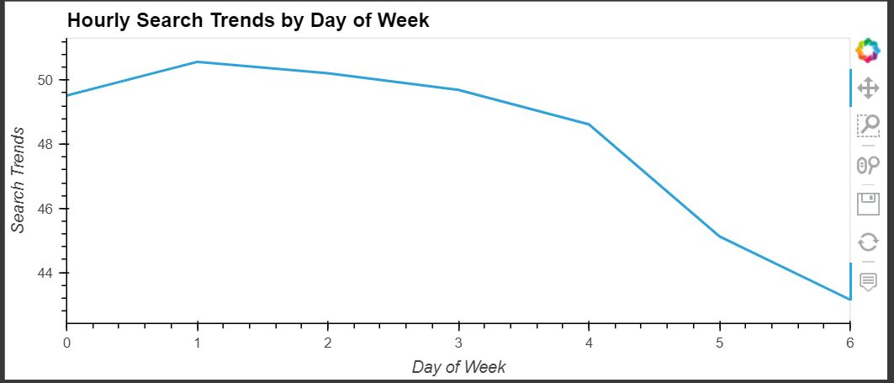
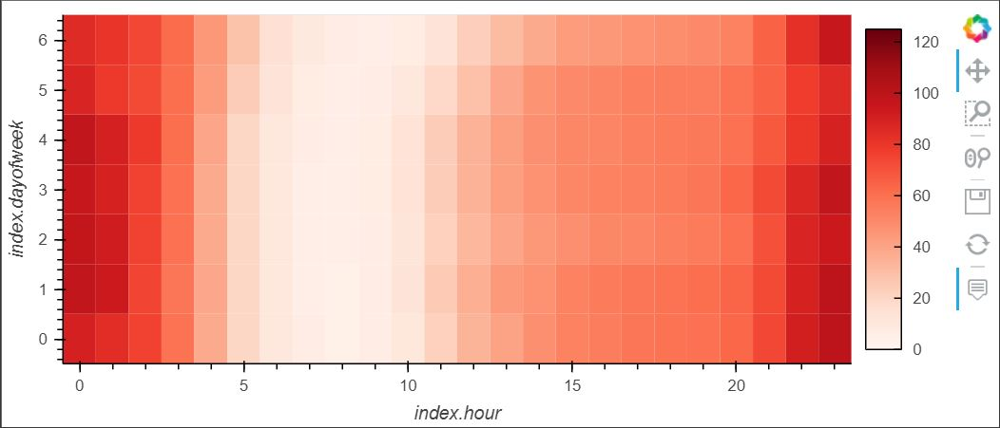
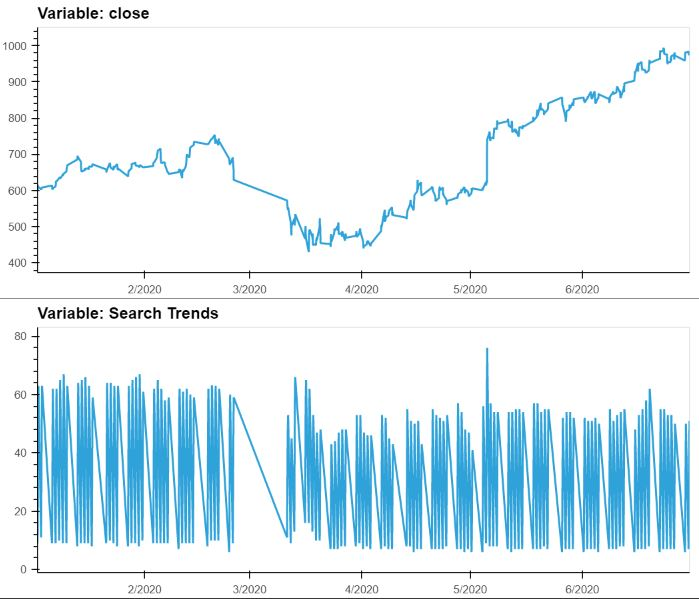
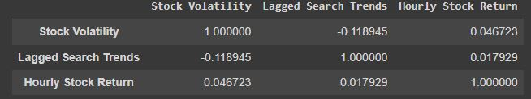
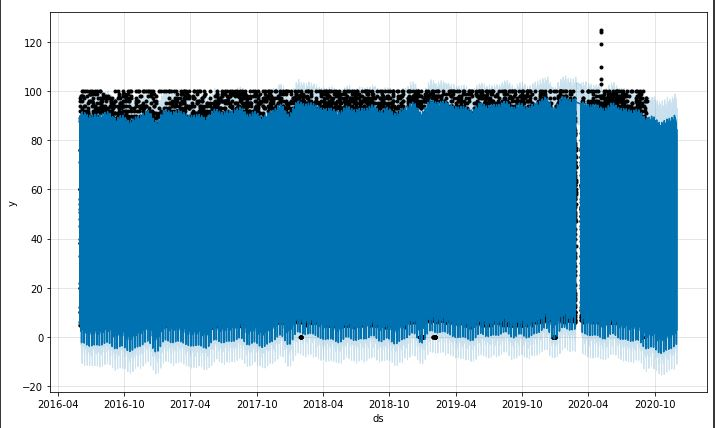
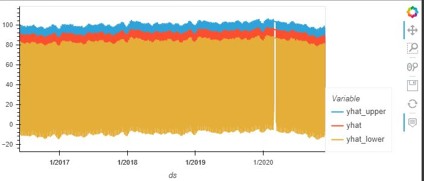
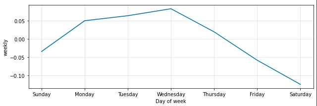
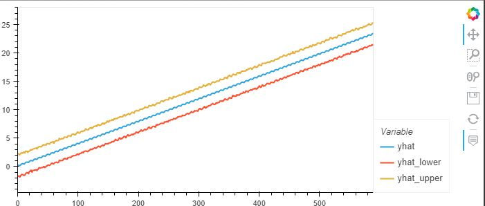

# Assignment---Module-11

The Google Colab notebook for this project can be found here:

https://colab.research.google.com/drive/1DsYtplpcXTWPvOG9A2naeCNeXACivv4q?usp=sharing

# Purpose

The purpose of this project is to analyse search trends for the company MercadoLibre. From this analysis, the aim is to mine the search trends for seasonality, thereby generating actionable results that can improve the company's expenditure on marketing.

Search trends are also compared to stock price patterns in an attempt to find correlations.

A time series model is created using Prohpet that attempts to predict search trends for the near future.

# The Data

The data used in this project is is "google_hourly_search_trends.csv" which details the search trends for the company MercadoLibre. It provides search trends from 2016 until 2020.

# Stages of Machine Learning

For the specific Machine Learning section I create a Time Series model with Prophet.

I begin by resetting the index and renaming the columns of my data to ensure they meet the requirements of Prophet - (columns named "ds" and "y").

All null value rows are dropped as they cause problems for Prophet's predictive ability.

I build the Prohet model.

.fit the dataframe to our model.

I then call .make_future_dataframe for an hourly period of 2000, thereby creating a dataframe extending into the future, as yet without "y" column values.

I ten call .predict to creat predictions for the period in the previous step. Predictions include "yhat" (most likely value), "yhat_upper" (best case value), and "yhat_lower" (worst case value).

These predictions are then plotted.

Forecast results are aslo plotted and some analysis is done to create recommendations for MercadoLibre's marketing budget.

# Methods Used

This project uses Google Colab (https://colab.research.google.com/) for convenience. It is a cloud based Jupyter Notebook service. I use Python to write my code.

When installing the required libraries I use pystan~=2.14 to resolve dependeny issues with fbprophet.

- hv.extension("bokeh") is used for visualizations throughout the notebook.

- .groupby is made use of extensively, along with .index.hour , .index.dayofweek , .index.month , in order to better analyse trends in the data.

- hvplot.heatmap visualization is used to illustrate trends in the weekly and hourly data.

- .loc function is used to isolate periods in the time series data in order to better understand the effect external events had on closing prices and search trends.

- .shift is used to move the data values forward in order to see the lagged search trends in the data.

- .corr is used to see whether there are any correlations between the features in our data.

- Prophet() is used to create a time series model, allowing us to generate prediction on likly future data, given our historical data.

- .make_future_dataframe is used to generate the dataframe that will hold our predicted data values.

- .plot_components is used within Prophet() to see visualisations of daily, weekly and yearly trends in our predicted data.

# Results

1. The search traffic for the company is affected by external events. For the month of May, when the company released it's quarterly financial results, the search traffic increased by 3008.

2. Interest in the company fluctuates depending on day of week and time of day. The results show that interest in the company, based on search traffic, is at it's highest on Tueday.

And across the week search traffic is highest during the early and late hours of the day.

3. Search traffic data and the closing price data for the company support the narrative of market events causing difficulty and a downward trend during the first half of 2020.

There seems to no strong correlation between lagged search traffic and the stock volatility or between the lagged search traffic and the stock price returns.

]

4. The near term forecast for MercadoLibre's popularity sees a continuing downward trend with a slight rise from October onwards, according to the generated time series model.

- The beginning and ending hours of the day expereince the highest popularity.
- Tuesday is the day of the week that gets the most search traffic.
- October is the lowest point for search traffic in the calendar year.

5. The peak revenue days for the company are from Monday, Tuesday, and reaching a high on Wednesday.

From the time series model, predicted sales for the next quarter look positive.

- Best case scenario : 1050.7
- Worst case scenario : 887.2
- Most likely scenario : 969.6
